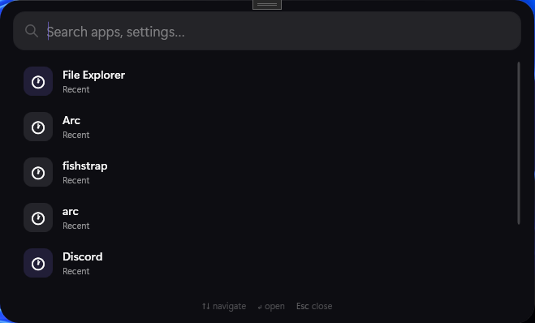

<div align="center">

# VLaunch

### modern launcher for Windows

<div align="center">
  
</div>

Windows launcher inspired by Raycast and Spotlight

---


</div>

---

# what is this

VLaunch is a modern launcher for Windows built with C# and WPF.

It focuses on fast keyboard-driven workflows, a clean interface and deep customization.

Instead of navigating through cluttered menus and desktop shortcuts, VLaunch lets you instantly search and launch apps from a minimalistic launcher.

---

# features

* app launching
* keyboard-focused workflow
* glassmorphism ui
* local-first configuration
* recent searches
* json theme system
* configurable hotkeys
* smooth modern interface
* lightweight design

---

# planned

* acrylic blur
* startup wizard
* tray support
* startup behavior
* plugin system
* file searching
* command palette
* better indexing
* real app icons
* animations
* settings page

---

# local storage

all launcher data is stored locally:

```txt
%AppData%/VLaunch/
```

example structure:

```txt
config.json
history.json
Themes/
apps-cache.json
```

---

# themes

VLaunch uses JSON-based themes.

example:

```json
{
  "name": "Dark Glass",
  "background": "#991F1F23",
  "accent": "#8B5CF6",
  "text": "#FFFFFF",
  "cornerRadius": 16,
  "blur": true
}
```

---

# status

VLaunch is currently in active development and is not publicly released yet.

---

# license

Copyright (c) 2026 voided

All rights reserved.

You may NOT:

* redistribute
* modify
* resell
* repost
* claim this project as your own

without explicit permission from the author.
