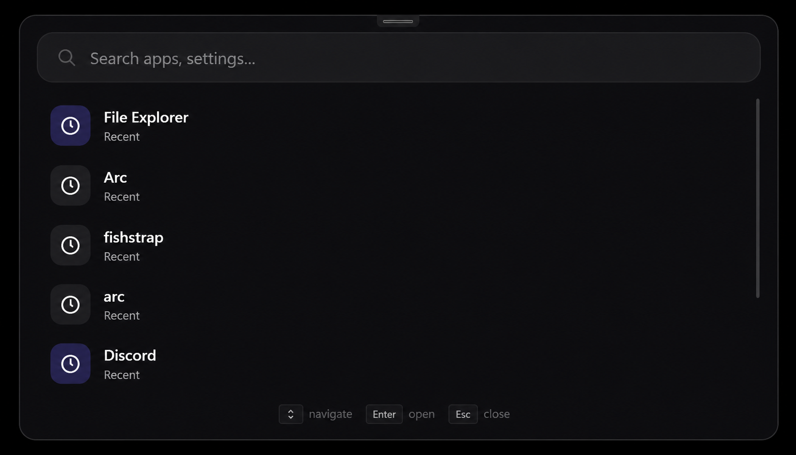

<div align="center">

# VLaunch

### Modern launcher for Windows



Keyboard-focused application launcher inspired by Raycast and Spotlight.

<br>


</div>

---

## Table of Contents

* [Introduction](#introduction)
* [Features](#features)
* [Installation](#installation)
* [Theming](#theming)
* [Local Storage](#local-storage)
* [Roadmap](#roadmap)
* [Screenshots](#screenshots)
* [License](#license)

---

## Introduction

VLaunch is a modern launcher for Windows built with C# and WPF.

Designed around speed and keyboard-first workflows, VLaunch allows you to instantly launch applications without digging through desktop shortcuts, folders, or the Start Menu.

The project takes inspiration from Raycast, Spotlight, Flow Launcher, and other productivity-focused launchers while maintaining its own lightweight and customizable approach.

---

## Features

* Fast application launching
* Keyboard-first workflow
* Search history
* System tray support
* Local configuration
* JSON-based theming
* Custom hotkeys
* Modern glass-inspired interface
* Lightweight design
* Fully local data storage

---

## Installation

1. Download the latest release from the Releases page.
2. Run the installer.
3. Complete setup.
4. Launch VLaunch from the Start Menu or desktop shortcut.

### Requirements

* Windows 10 or Windows 11
* x64 processor

---

## Theming

VLaunch supports custom JSON themes.

Example theme:

```json
{
  "Name": "Dark Glass",
  "Background": "#991F1F23",
  "SearchBackground": "#552C2C31",
  "Accent": "#8B5CF6",
  "Text": "#FFFFFF",
  "MutedText": "#99FFFFFF",
  "Border": "#30FFFFFF",
  "CornerRadius": 18,
  "SearchRadius": 16,
  "Blur": true
}
```

Theme files are stored in:

```txt
%AppData%\VLaunch\Themes
```

Users can create their own themes by adding additional JSON files to the Themes folder.

---

## Local Storage

All launcher data is stored locally.

Location:

```txt
%AppData%\VLaunch
```

Structure:

```txt
VLaunch
├── config.json
├── history.json
└── Themes
    ├── DarkGlass.json
    ├── AMOLED.json
    └── CustomTheme.json
```

---

## Roadmap

### Planned

* Acrylic blur improvements
* Startup wizard
* Settings page
* Better application indexing
* File search
* Command palette
* Plugin system
* Custom launcher commands
* Improved animations
* Additional theme customization
* More built-in themes

---

## Screenshots

### Main Window


---

## Status

VLaunch is currently in beta and under active development.

Features, behavior, and configuration options may change between releases.

---

## License

Copyright (c) 2026 voided

All Rights Reserved.

You may not:

* Redistribute
* Modify
* Resell
* Reupload
* Claim this project as your own

without explicit permission from the author.
